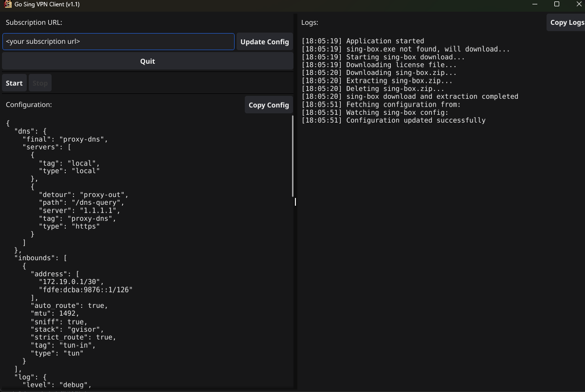

# Go-Sing VPN Client GUI

<div style="display: flex; justify-content: space-between; align-items: center;">

</div>

A Windows VPN client GUI for sing-box written in Go. 

> **⚠️ Note**: This is an independent project with no association or endorsement from the sing-box team.

## ✨ Features

<div style="display: flex; justify-content: space-between; align-items: center;">

</div>


- **Full sing-box compatibility**: Supports all sing-box features including DNS, routing, and different outbound protocols
- **Auto-updates**: Automatically downloads and updates sing-box binaries
- **Easy configuration**: Simple GUI for managing VPN connections
- **System tray**: Minimize to system tray for background operation
- **Admin privileges**: Automatic elevation when required
- **Customizable**: Support for custom delivery configurations

## 📋 Requirements

- Admin privileges required for VPN operations
- Self-hosted config

## 🚀 Quick Start

### For Users

1. Download the latest release
2. Run `go-sing.exe`
3. Enter your subscription URL (sing-box config JSON)
4. Click "Update Config" to fetch the configuration
5. Click "Start" to connect to VPN

### For Developers

#### Prerequisites

```bash
go mod download
go install fyne.io/fyne/v2/cmd/fyne@latest
```

#### Build

```bash
fyne package -os windows
```

####  Delivery config
Check `delivery` folder to preload client with your own configuration before build.

## ⚙️ Configuration

###  Hosting Your Config

You need to host your sing-box configuration JSON file somewhere accessible via HTTP(S). Here are some free options:

- **GitHub Pages**: Create a public repository and enable GitHub Pages
- **Cloudflare Pages**: Deploy static files with Cloudflare
- **Netlify**: Host static files for free
- **Any web server**: Host the JSON file on your own server

Your config should be a valid sing-box configuration. Check the [sing-box documentation](https://sing-box.sagernet.org/) for details.

## 🌐 Supported Protocols

Since this client uses sing-box, it supports all protocols that sing-box supports:

- Shadowsocks
- VMess
- VLESS
- Trojan
- Hysteria
- TUIC
- WireGuard
- And many more...

Check the [sing-box documentation](https://sing-box.sagernet.org/configuration/outbound/) for the complete list.

## 🔧 Troubleshooting

###  Common Issues

1. **"Admin privileges required"**: The client needs admin rights to manage network interfaces
2. **"Config not found"**: Make sure your subscription URL returns a valid sing-box JSON config
3. **"sing-box not available"**: Check your internet connection - the client downloads sing-box automatically
